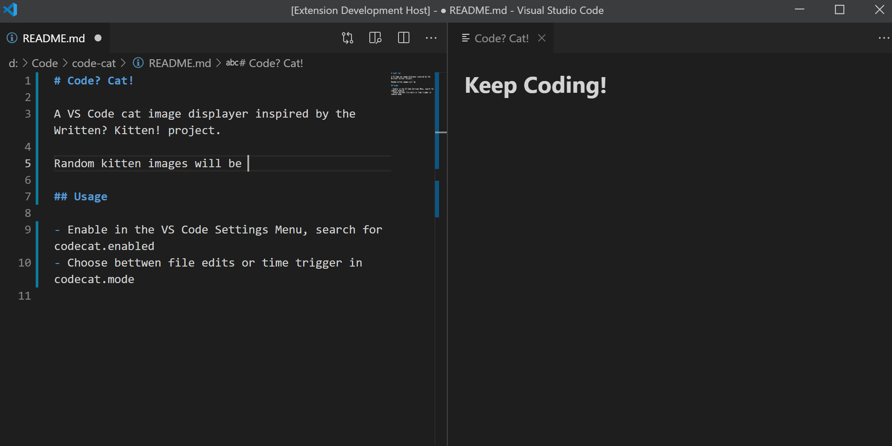

# Code? Cat!

A VS Code cat image displayer inspired by the Written? Kitten! project.

## Features

> It's all about code & cats!

## Usage

- Enable in the VS Code Settings Menu, search for codecat.enabled
- Choose bettwen file edits or time trigger in codecat.mode

## License

[MIT](LICENSE.md)
